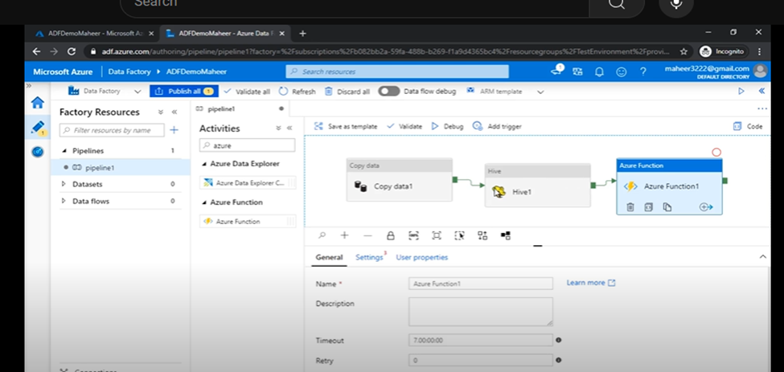
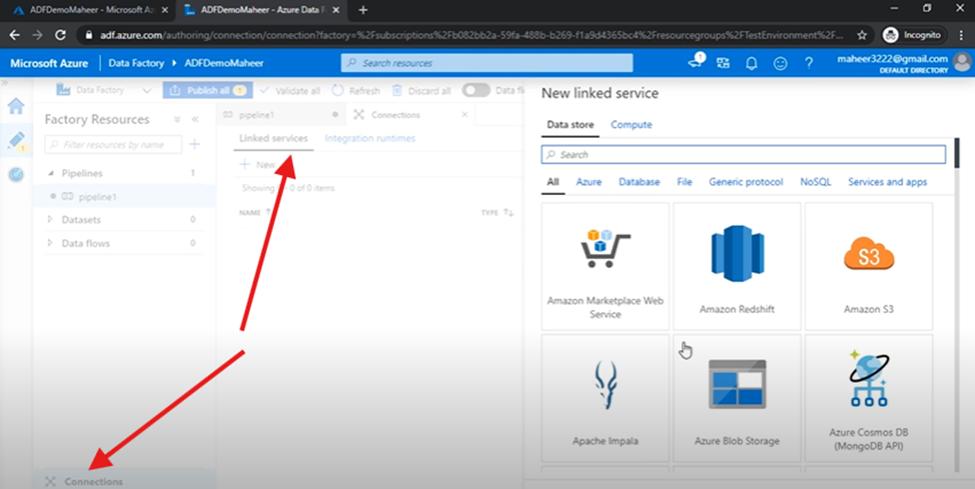
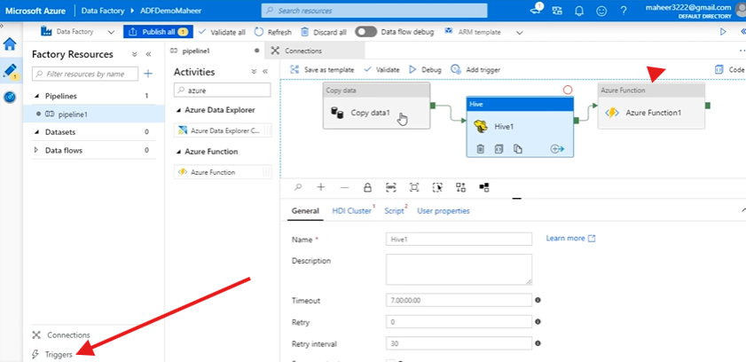

## Azure Data Factory: 
Azure data factory is azure cloud ETL service for scale-out serverless data integration 
And data transformation. You can also lift and shift existing SSIS (SQL server and integration service) packages to azure and run them with full compatibility in ADF.
It is the cloud based ETL and data integration service that allows you to create data-driven workflows for orchestration data movement and transforming data at scale.

## Why Azure Data Factory:
Big data requires services that can orchestrate and operationalize processes to refine these enormous stores of raw data into actionable business insights. Azure data factory is a managed cloud service that’s built for complex hybrid extract transform load, extra-load-transform and data integration projects.

## Top level Concepts in azure data factory:
Pipeline, activity, Data sets, linked services, triggers

### Pipeline:
A data factory might have one or more pipeline. A pipeline is a logical grouping of activities that performs a unit of work. 
For Example: a pipeline can contain a group of activities that ingests data from an azure blob, and them runs a hive query in an HDInsight cluster to partition the data. 

### Activity:
Activity represents a processing step in a pipeline. For example, you might use a copy activity to copy data from one data store to another data store.

### linked services & Data sets:
linked services: are much like connection strings, which define the connection information that’ s needed from data factory to connect to external resources.
Datasets: represent data structures within the data store, which simply point to or reference the data you want to use your activities.
For example: an azure storage linked specifies a connections string to connect to the azure storage account. Additionally, an azure blob dataset specifies the blob container and the folder that contains the data.

### Triggers:
Triggers determines when a pipeline execution needs to be kicked off.
There are different types of triggers.

## Create your First Azure Data Factory
Pre-requisites:
1.	Azure Subscription 
2.	Azure Storage account 

## Different ways to work with Azure Data Factory
1.	Azure Portal UI 
2.	Azure PowerShell (Install Azure PowerShell)
3.	.NET
4.	Python 
5.	REST
