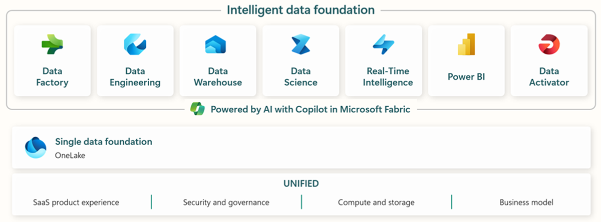
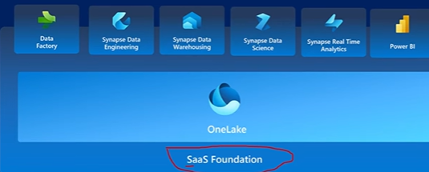
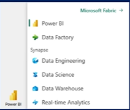

## Microsoft Fabric:
### What is Microsoft Fabric?
Microsoft Fabric is an all-in-one analytics solution for enterprises that covers everything from data movement to data science, real-tie analytics, and business intelligence. It offers a comprehensive suite of services, including data lake, data engineering and data integration all in one place.

Microsoft Fabric brings together new and existing components from power BI, Azure Synapse, and Azure Data Factory into a single integrated environment.

### Microsoft Fabric General Terminology 

#### Capacity: 
Capacity is a dedicated set of resources that is available at a given time to be used. Capacity defines the ability of a resource to perform an activity or to produce output. Fabric offers capacity through the Fabric SKU and trials.

#### Experience:
A collection of capabilities targeted to a specific functionality. The Fabric experiences include Synapse Data Warehouse, Synapse Data Engineering, Synapse Data Science, Synapse Real-Time Analytics, Data Factory and power BI

#### Item: 
An item a set of capabilities within an experience. For example, the Data Engineering experience includes the Lakehouse, notebook and Spark job definition items.  

#### Tenant: 
A tenant is a single instance of fabric for an organization and is aligned with a Microsoft Entra ID.

#### Workspace: 
A workspace is a collection of items. It acts as a container that leverages capacity for the work that is executed and provides controls for who can access the items in it. For example, in a workspace, users create reports, notebooks, semantic models.

### What is OneLake?
OneLake is a cloud-based data lake platform that allows organizations to store and manage large amounts of data in its native format, without requiring a predefined schema. This enables organizations to store data from various sources, such as IoT devices, social media, and applications, in a single repository.
#### Benefits of OneLake:
1. Centralized data management
2. Improved data governance
3. Faster time-to-insight
4. Cost-effective

### How to Create a OneLake in Microsoft Fabric
To create a OneLake in Microsoft Fabric, follow these steps:

#### Prerequisites:
You need to have a Microsoft Fabric tenant set up.
You need to have the necessary permissions to create a OneLake.
##### Step 1: Navigate to the Fabric Portal

Log in to the Microsoft Fabric portal using your credentials.
Click on the "Create a resource" button.

##### Step 2: Choose the OneLake Resource

In the "Create a resource" page, select "OneLake" from the list of available resources.
Click on the "Create" button.

##### Step 3: Configure OneLake Settings

In the "Create OneLake" page, enter a name for your OneLake.
Choose the subscription and resource group for your OneLake.
Select the location for your OneLake.
Choose the capacity unit for your OneLake (e.g., small, medium, large).
Click on the "Create" button.

##### Step 4: Configure Data Lake Settings

In the "Data Lake Settings" page, choose the data lake type (e.g., Gen1, Gen2).
Configure the data lake storage settings (e.g., storage account, container).
Click on the "Save" button.

##### Step 5: Configure Security Settings

In the "Security Settings" page, configure the security settings for your OneLake (e.g., authentication, authorization).
Click on the "Save" button.

##### Step 6: Review and Create OneLake

Review the OneLake settings and configuration.
Click on the "Create" button to create the OneLake.
Post-Creation Steps:

Once the OneLake is created, you can start ingesting data into it using various data sources (e.g., Azure Data Factory, Power BI).
You can then use the OneLake to store, manage, and analyze your data using various Fabric experiences (e.g., Synapse Data Warehouse, Synapse Data Engineering).