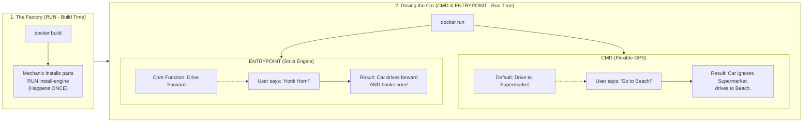
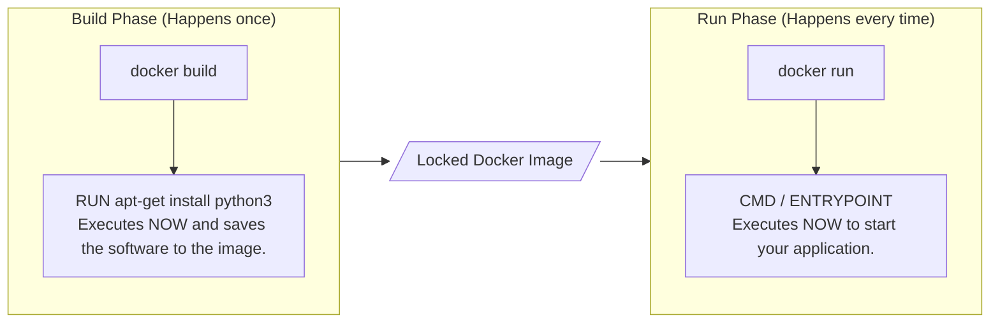
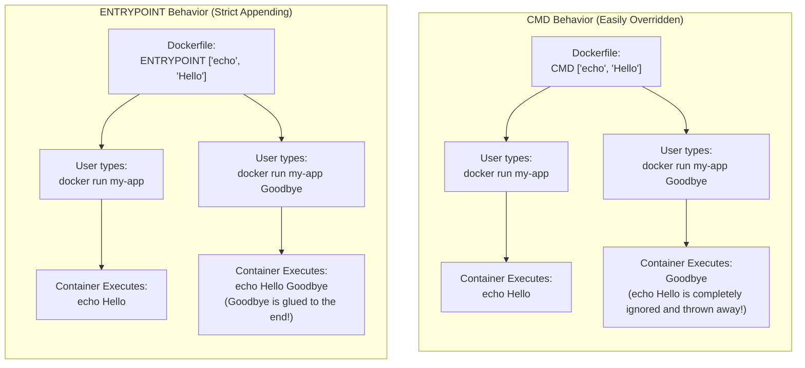
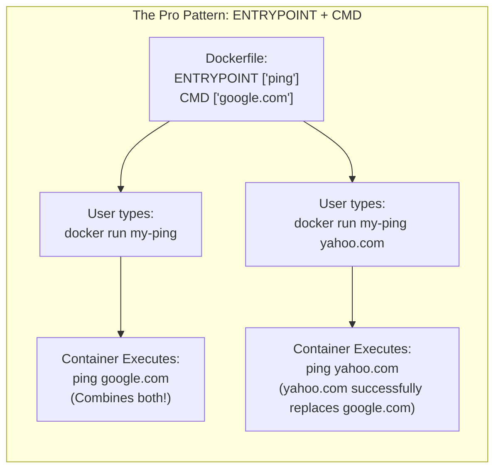

# RUN vs CMD vs ENTRYPOINT

These three commands are the most confused instructions in Docker.

---

## 1. The Simple Analogy: Building and Driving a Car

Imagine Docker is a car factory. 

* **`RUN` is the Factory Mechanic:** This happens at the factory (`docker build`). The mechanic installs the engine. Once the car leaves the factory, the mechanic's job is completely finished.
* **`CMD` is the Flexible GPS:** This happens when you sit in the car and turn the key (`docker run`). The GPS is set to "Supermarket" by default. But if you shout "Beach!", the car completely ignores the Supermarket and goes to the beach instead. It is easily replaced.
* **`ENTRYPOINT` is the Strict Engine:** This also happens when you turn the key. The engine is programmed to "Drive Forward." If you shout "Honk the horn!", the car does NOT stop driving forward. It drives forward *AND* honks the horn. It glues your command to its core function.

---

## 2. The Timeline: When do they happen in code?

Moving back to the technical side, the biggest difference between `RUN` and `CMD`/`ENTRYPOINT` is the timeline. 
* **`RUN`** executes on your laptop while the image is being created. It is used to install software.
* **`CMD` & `ENTRYPOINT`** do absolutely nothing during the build process. They only wake up and execute when the container is finally started on a server.

---

## 3. CMD vs ENTRYPOINT (Technical Behavior)

Here is exactly what happens in your terminal when you try to pass extra arguments to your container.

---

## 4. The Professional Pattern (Using them together)

The absolute best practice in Docker is to use them together. 

You use `ENTRYPOINT` to define the main software that must always run (like `ping` or `npm`), and you use `CMD` to define the default arguments that the user is allowed to change. 

If the user provides no input, it uses the `CMD` default. If the user provides input, it replaces `CMD` but keeps `ENTRYPOINT`!

### Summary Rule of Thumb:
* Need to **install** something? Use `RUN`.
* Need to **start** your app, but want users to easily open a `bash` terminal inside it instead? Use `CMD`.
* Building a container that acts like a strict command-line tool? Use `ENTRYPOINT` and `CMD` together.
