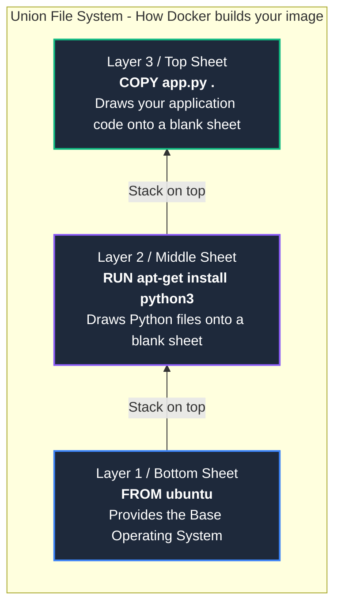

# Docker Architecture

To truly master Docker, you must understand how it manages files, memory, and storage behind the scenes.

---

## 1. The Union File System (The "Transparent Sheets" Concept)

Docker does not store your image as one giant block of data. Instead, it breaks it down into **Layers**. 
Think of layers like a stack of transparent plastic sheets. Each command in your `Dockerfile` creates a brand new transparent sheet and draws new files onto it. When you look down from the top, all the sheets blend together to create one complete picture. This technology is called the **Union File System**.



---

## 2. The Golden Rule of Layers (The Bad Way vs The Good Way)

Because every single command creates a permanent "Snapshot" (Layer), you must be very careful when downloading and deleting files. 

If you download a heavy zip file in one layer, and delete it in the *next* layer, **the zip file is still permanently saved in the previous layer!** It is merely "hidden" in the next layer, but still taking up space on your hard drive. 

To keep your images lightweight, you must download, extract, and delete the file in a **single command** so the snapshot is taken *after* the garbage is deleted.

```mermaid
flowchart BT
    subgraph BadWay [THE BAD WAY (Separate RUN commands)]
        direction BT
        B1[Layer 1<br>FROM ubuntu] style B1 fill:#333,color:#fff
        B2[Layer 2<br>RUN wget 100MB.zip<br><b>100MB saved permanently!</b>] style B2 fill:#7f1d1d,color:#fff
        B3[Layer 3<br>RUN tar -xzf 100MB.zip<br><b>Another 100MB saved for extracted files</b>] style B3 fill:#333,color:#fff
        B4[Layer 4<br>RUN rm 100MB.zip<br><b>Zip is hidden, but STILL takes space in Layer 2!</b>] style B4 fill:#7f1d1d,color:#fff
        
        B1 --> B2 --> B3 --> B4
    end

    subgraph GoodWay [THE GOOD WAY (Single RUN command)]
        direction BT
        G1[Layer 1<br>FROM ubuntu] style G1 fill:#333,color:#fff
        G2[Layer 2<br>RUN wget && tar && rm<br><b>Zip is downloaded, extracted, and deleted BEFORE the snapshot is taken.<br>Image stays perfectly light!</b>] style G2 fill:#064e3b,color:#fff
        
        G1 --> G2
    end
```

---

## 3. Image Layers vs Container Layer (Read-Only vs Read/Write)

What is the actual difference between an "Image" and a "Container"?
* **An Image is Dead:** It is just a stack of **Read-Only** layers sitting on your hard drive. Once an image is built, its layers are locked forever. They can absolutely never be changed.
* **A Container is Alive:** When you run `docker run`, Docker does not unlock the image. Instead, it adds a single, microscopic **Read/Write** layer on the very top of the stack. Whenever your running application writes a log file, saves a user upload, or modifies a database, that data goes **only into this top Read/Write layer**.

```mermaid
flowchart BT
    subgraph Container [Running Container Environment]
        direction BT
        
        L1[Layer 1: Base OS<br>Read-Only] style L1 fill:#1e293b,stroke:#333,stroke-width:2px,color:#94a3b8
        L2[Layer 2: Dependencies<br>Read-Only] style L2 fill:#1e293b,stroke:#333,stroke-width:2px,color:#94a3b8
        L3[Layer 3: App Code<br>Read-Only] style L3 fill:#1e293b,stroke:#333,stroke-width:2px,color:#94a3b8
        
        RW[Container Layer<br>READ / WRITE <br>All new data and changes happen here] style RW fill:#064e3b,stroke:#10b981,stroke-width:3px,color:#fff
        
        L1 --> L2 --> L3 -.->|docker run adds this layer| RW
    end
```
> [!IMPORTANT]
> When you delete a container (`docker rm`), **only the Read/Write layer is destroyed**. The underlying Read-Only Image layers remain safely on your hard drive, allowing you to instantly spin up a brand new, clean container in milliseconds.

---

## 4. The Copy-on-Write (CoW) Strategy

**The Dilemma:** If the bottom image layers are completely locked (Read-Only), how can a running container modify a configuration file that exists in the base image?

**The Solution:** Docker uses a brilliant mechanism called **Copy-on-Write (CoW)**. It never touches the locked layer. Instead, the moment an application tries to edit an existing file, Docker pulls a physical copy of that file UP into the Read/Write layer, modifies it there, and visually "hides" the original file underneath.

```mermaid
flowchart TD
    subgraph Docker_CoW [Copy-on-Write Mechanism]
        direction LR
        
        subgraph ReadOnly [Locked Image Layer (Read-Only)]
            O_File[Original config.json] style O_File fill:#1e293b,color:#94a3b8
        end
        
        subgraph ReadWrite [Top Container Layer (Read/Write)]
            M_File[Modified config.json] style M_File fill:#064e3b,color:#fff
        end
        
        O_File -- "1. App tries to edit. Docker copies the file UP" --> M_File
        M_File -. "2. Original file remains safe, but is now hidden" .-> O_File
    end
```

---

## 5. The Docker Build Cache (Why the order of commands matters)

Docker builds images blazingly fast because it caches every single layer. If you rebuild an image and a layer hasn't changed, Docker just reuses the cached snapshot instead of running the command again.

**The Golden Rule of Caching:** If a layer changes, that layer AND **ALL** LAYERS ON TOP OF IT are thrown away and rebuilt from scratch.

```mermaid
flowchart TD
    subgraph Caching [Why the order in your Dockerfile is critical]
        direction TB
        
        Step1[FROM node:18<br>Cached] style Step1 fill:#166534,color:#fff
        Step2[COPY package.json .<br>Cached] style Step2 fill:#166534,color:#fff
        Step3[RUN npm install<br>Cached] style Step3 fill:#166534,color:#fff
        Step4[COPY . .<br>YOU CHANGED YOUR CODE! Cache Broken] style Step4 fill:#991b1b,color:#fff
        Step5[CMD npm start<br>Rebuilt because layer below broke cache] style Step5 fill:#b45309,color:#fff
        
        Step1 --> Step2 --> Step3 --> Step4 --> Step5
    end
```
> [!TIP]
> **Best Practice:** This is exactly why professionals copy `package.json` (or `requirements.txt`) and run installations **before** copying their source code. 
> 
> If you copy your source code first, every single time you change just one line of code, you will break the cache at the very beginning, and Docker will be forced to spend 5 minutes re-downloading all your dependencies!
