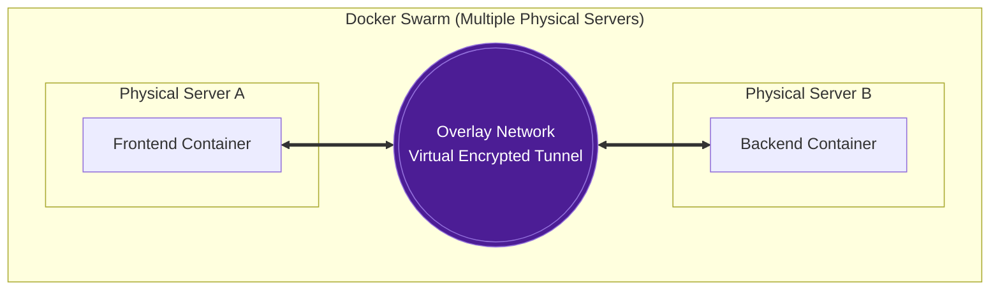
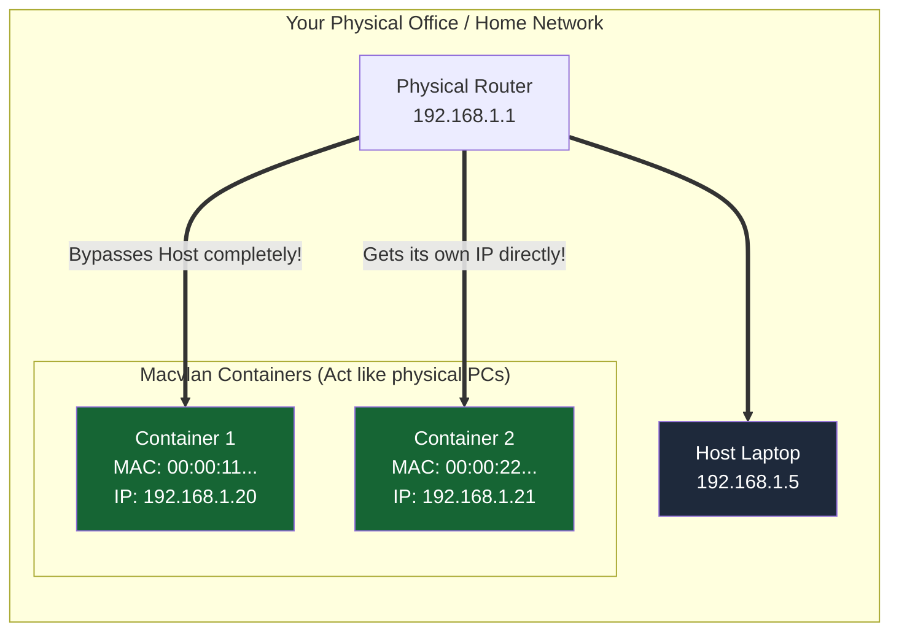

# Advanced Docker Networks: Overlay & Macvlan

These two network drivers are for advanced, enterprise-level scenarios.

---

## Part 1: The `overlay` Network (The Magic Tunnel)

### The Analogy (Two Office Buildings)
Imagine you have two office buildings (Server A and Server B) located in entirely different cities. 
The employees (Containers) in Building A want to talk to the employees in Building B using the internal office intercom. Usually, this is impossible because they are separated by the public internet.

An `overlay` network builds a secure, invisible, virtual tunnel between the two cities. To the employees inside the containers, it feels exactly like they are walking down the hallway in the same building. They can ping each other by name, completely unaware that they are physically miles apart!



### When to use it?
You use this **only** when you are running a cluster of multiple servers (using **Docker Swarm**). If you have 5 servers working together, the `overlay` network connects all 5 of them into one giant, unified virtual bridge.

### How to implement it (The Code)

Because `overlay` networks are for multi-server clusters, you must turn on Docker Swarm first.

**Step 1: Turn your server into a Swarm Manager**
```bash
docker swarm init
```

**Step 2: Create the Overlay Network**
Notice the `-d overlay` flag. This tells Docker to build the magic tunnel.
```bash
docker network create -d overlay my-magic-tunnel
```

**Step 3: Run containers on this network**
In a Swarm, we use `docker service` instead of `docker run`.
```bash
docker service create \
  --name my-backend \
  --network my-magic-tunnel \
  nginx
```
*(Docker will automatically distribute your containers across your different servers, and they will all communicate securely through the tunnel!)*

---

## Part 2: The `macvlan` Network (The True IP Identity)

### The Analogy (The Hotel vs The House)
Usually, containers live in a **Hotel** (your Host Laptop). When internet traffic arrives, the hotel receptionist (Port Mapping / Bridge) takes the package at the front desk and delivers it to the container's room. The container does *not* have its own street address; it hides behind the hotel's IP address.

A `macvlan` network moves the container out of the hotel and gives it its own **Private House** on the street. It gets its own real Street Address (IP Address) and its own Mailbox (MAC Address) directly from the city's post office (your physical Wi-Fi/Ethernet router). 



### When to use it?
You use this when migrating very old, legacy applications that refuse to work with Port Mapping. Or, you use it when your IT Security department demands that the container must have a real, trackable IP address on the physical office network.

### How to implement it (The Code)

To create a Macvlan network, you have to tell Docker exactly what your physical office/home network looks like. 
*(Let's assume your home router is `192.168.1.1`, and your laptop connects to the router via the `eth0` network cable).*

**Step 1: Create the Macvlan Network**
You must specify the subnet, the router gateway, and the physical network card (`parent=eth0`).
```bash
docker network create -d macvlan \
  --subnet=192.168.1.0/24 \
  --gateway=192.168.1.1 \
  -o parent=eth0 \
  my-physical-net
```

**Step 2: Run the container and assign a real IP!**
Now, you can force the container to use a specific, real IP address on your physical network.
```bash
docker run -d \
  --name legacy-app \
  --network my-physical-net \
  --ip 192.168.1.50 \
  nginx
```

### The Result
You have completely bypassed the Host laptop! Anyone in your office can open their browser, type `http://192.168.1.50`, and they will connect directly to the container. Your laptop's IP address is entirely ignored by the container.
