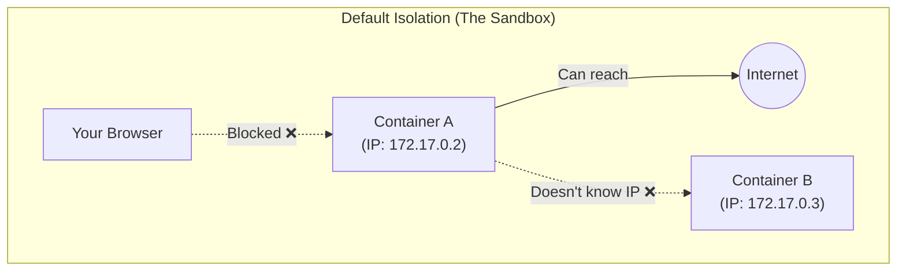
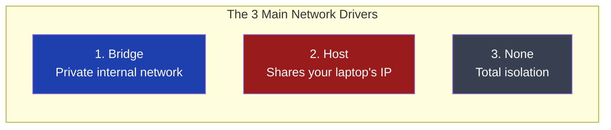
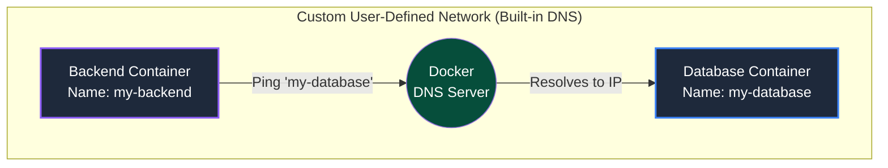
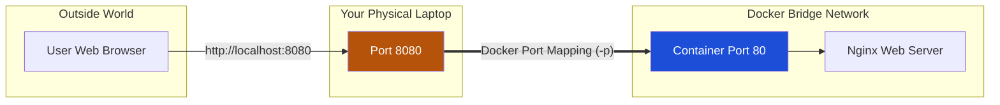

# Docker Networking: Deep Dive

When you run multiple containers (like a React Frontend, a Node.js Backend, and a MySQL Database), they need a way to talk to each other securely. 
By default, Docker isolates everything. To connect them, you must understand Docker Networking.

---

## 1. The Default State: The Isolated Sandbox

When you start a container without specifying a network, Docker places it in the default `bridge` network. 
In this default state:
1. The container can usually reach out to the internet to download things.
2. The outside world **cannot** reach inside the container.
3. Containers **cannot** talk to each other easily (they have to use IP addresses, which change every time a container restarts).



---

## 2. The Three Main Network Drivers

Docker provides three built-in ways to handle networking, called "Drivers."

### A. The `bridge` Network (The Default)
This is a private, internal network created inside your host machine. Containers on the same bridge network can communicate, but they are hidden from the outside world.

### B. The `host` Network (No Isolation)
If you run a container with `--network host`, Docker completely removes the network isolation. The container shares your laptop's exact IP address and ports. If the container runs a web server on port 80, your laptop's actual port 80 is used. 
* *Warning:* This is fast, but dangerous because of port conflicts!

### C. The `none` Network (Total Lockdown)
If you use `--network none`, the container is completely cut off from everything. No internet, no host connection, no other containers. It is entirely alone. Highly secure, but rarely used unless for highly sensitive offline tasks.



---

## 3. User-Defined Bridge Networks (The Magic of DNS)

This is the most important concept for developers! 
The default `bridge` network is old and lacks features. Professionals always create a **Custom User-Defined Bridge Network**.

```bash
docker network create my-custom-network
```

**Why is this magical?**
Because custom networks come with a built-in **DNS Server**. 
If you put your Backend container and Database container in the same custom network, they can talk to each other using their **Container Names** instead of IP addresses!


> [!TIP]
> In your Node.js or Python code, instead of connecting to `172.20.0.5:3306`, you literally just write the connection string as `mysql://my-database:3306`. Docker automatically routes the traffic to the correct container, even if the IP address changes!

---

## 4. Publishing Ports (Bridging the Gap)

If your containers are safely tucked away in a private Bridge network, how does a user sitting at their web browser access your React application?

You have to punch a specific hole through the firewall using **Port Mapping** (`-p`).

When you run `docker run -p 8080:80 my-app`, you are telling Docker: 
*"Listen to port 8080 on my physical laptop, and silently forward all that traffic into port 80 of this specific container."*



### Summary of Best Practices:
1. **Never** use the default bridge network for multi-container apps.
2. **Always** create a custom network so your containers can talk to each other via their names (DNS).
3. **Only** publish (`-p`) the ports that the outside world *needs* to see (like your Frontend). Do not publish your Database ports to your laptop unless you need to debug them directly!
