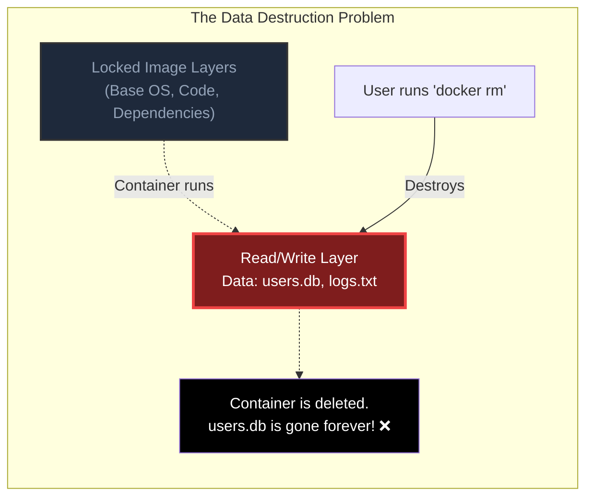
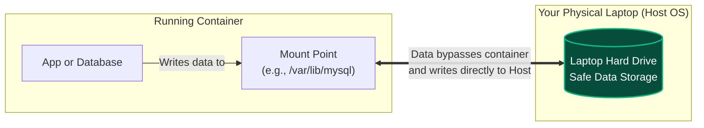
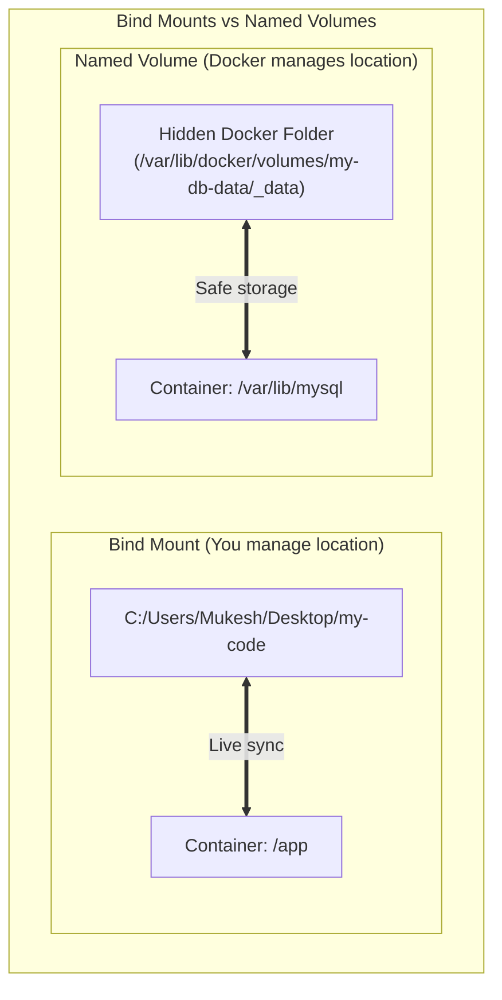

# Docker Volumes

To understand why we need Docker Volumes, we first have to understand the biggest "flaw" (and feature) of Docker containers: **Data Destruction.**

---

## 1. The Problem: The Ephemeral Read/Write Layer

As we learned in the Architecture Guide, when a container runs, it stores all new data (like database entries, user uploads, logs) in the **top Read/Write layer**. 

The problem is that containers are *ephemeral* (temporary). When you delete a container (`docker rm`), Docker completely destroys that Read/Write layer. **Any data saved inside it is lost forever.** If you are running a database container like MySQL or PostgreSQL, deleting the container means losing your entire database!

---

## 2. The Solution: Docker Volumes

A Docker Volume is a way to **bypass the Union File System entirely**. 
Instead of saving data inside the container's fragile Read/Write layer, you punch a "hole" in the container and connect it directly to a folder on your Host Machine (your laptop or server's physical hard drive).

Because the data is actually living on your physical laptop, if the container is destroyed, the data remains perfectly safe on your hard drive. When you start a new container, you just plug it back into the same hole!

---

## 3. The Two Main Types of Mounts

There are two primary ways to connect the container to your laptop's hard drive. It is critical to know the difference between them.

### A. Bind Mounts (You are the boss)
With a Bind Mount, you tell Docker **exactly** which folder on your laptop to connect to the container. 
* **Use Case:** Local development. You connect your local code folder (`C:\my-code`) to the container's code folder (`/app`). When you edit code in VS Code on your laptop, the container sees the change instantly!
* **Command:** `docker run -v /c/my-code:/app my-image`

### B. Named Volumes (Docker is the boss)
With a Named Volume, you don't care *where* the data is stored on your laptop. You just tell Docker, "Create a safe space on my hard drive and call it 'my-db-data'". Docker manages the hidden folder location for you.
* **Use Case:** Databases and production data. It is much safer because normal laptop users won't accidentally delete the hidden folder.
* **Command:** `docker run -v my-db-data:/var/lib/mysql mysql`

---

## 4. Bypassing Copy-on-Write (Performance Boost!)

Beyond just keeping data safe, Volumes offer a massive performance benefit.

Remember the **Copy-on-Write (CoW)** mechanism? While CoW is brilliant for keeping images read-only, it is actually quite slow. If a database tries to constantly read and write thousands of records per second through the CoW layered system, the database will lag heavily.

Because Volumes **bypass** the layers completely and talk directly to the Host OS hard drive, they operate at native speeds. 

> [!TIP]
> **Best Practice:** If your container writes heavy logs or runs a database, you MUST use a Volume for that specific folder. Otherwise, the constant Copy-on-Write operations inside the container's Read/Write layer will destroy your application's performance.
