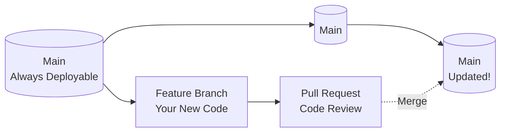
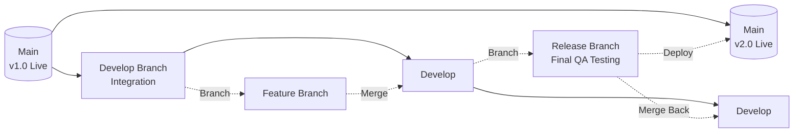
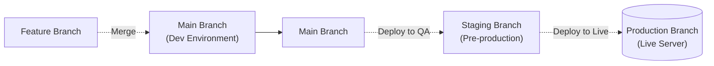
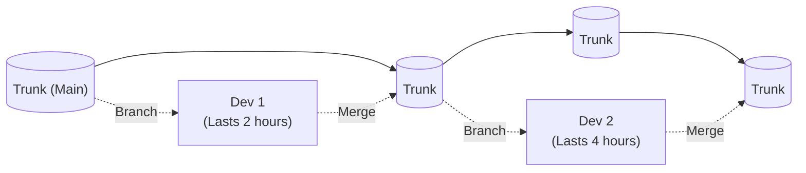

# The Ultimate Guide to Git Branching Strategies

Choosing how to manage your branches in Git is just as important as writing the code itself. If everyone on your team just creates branches randomly, your project will quickly turn into a chaotic mess of merge conflicts. 

That's where **Branching Strategies** come in. They are basically the "Rules of the Game" that your entire development team agrees to follow. Here is a breakdown of the 4 most popular strategies in the software industry, complete with visual diagrams and advice on exactly when to use them.

---

## 1. GitHub Flow (The Simple & Fast Way)

This is the absolute most popular strategy for modern web applications and SaaS products. The core rule is extremely simple: **`main` must always be perfectly clean and ready to deploy at any second.** All new work happens in temporary feature branches.

**How it works:**
1. Branch off `main` to create a `feature` branch.
2. Write your code and commit your work.
3. Open a Pull Request (PR) to discuss the changes and get a code review from your team.
4. Merge back into `main` and deploy to live immediately.

**Diagram:**

**Best For:** Startups, web apps, Continuous Integration/Continuous Deployment (CI/CD), and agile teams who deploy code multiple times a day.
**Don't Use If:** You are building software that relies on scheduled, massive version releases (like an iOS app, a desktop game, or medical software).

---

## 2. Git Flow (The Strict & Structured Way)

Git Flow is the heavy-duty, classic strategy. It uses strict branch naming conventions and keeps new development completely isolated from production until a specific "Release" day arrives. 

**How it works:**
- **`main`**: Only holds official, released versions (like v1.0, v2.0). You never code here.
- **`develop`**: The "messy" branch where all the active coding comes together from different developers.
- **`feature`**: Branches off `develop` for building new features.
- **`release`**: Branched off `develop` when you are getting ready to launch. Only bug fixes happen here, no new features.
- **`hotfix`**: Emergency branches created straight off `main` to fix critical live bugs.

**Diagram:**

**Best For:** Open-source projects, desktop software, mobile apps, or any team that works in strict "Versions" (v1, v2) or Sprints.
**Don't Use If:** You want to deploy small updates to your website every single day. Git Flow is far too slow and heavy for that.

---

## 3. GitLab Flow (The Environment-Driven Way)

GitLab Flow sits right between the simplicity of GitHub Flow and the strictness of Git Flow. It uses branches to physically represent your different servers or environments.

**How it works:**
Instead of abstract names like "develop" or "release", your branches match your environments. Code flows downstream.
- New code goes into `main` (for testing on a private Dev server).
- Then it gets merged into `staging` (for the QA/Testing team to play with).
- Finally, it gets merged into `production` (where it goes live to real users).

**Diagram:**

**Best For:** Companies with multiple testing servers (like Dev, QA, Staging, and Prod) and strict deployment approval rules.
**Don't Use If:** You only have one server (Production). In that case, just use GitHub Flow.

---

## 4. Trunk-Based Development (The Modern DevOps Way)

This is what elite tech companies (like Google, Facebook, and Netflix) use. The philosophy here is: "Long-living branches are evil because they cause massive merge conflicts." 

**How it works:**
There are almost no branches. Everyone commits straight to `main` (the Trunk) multiple times a day. If you *must* use a branch, it cannot exist for more than a few hours. Because unfinished code is constantly being pushed to the live server, developers use "Feature Flags" (IF/ELSE statements in the code) to hide half-finished buttons from real users.

**Diagram:**

**Best For:** Highly experienced DevOps teams, massive codebases, and teams that want to avoid "Merge Conflict Hell" forever.
**Don't Use If:** You have junior developers who might accidentally break the live app, or if you don't have a solid automated testing suite (CI/CD) to catch bugs before they go live.

---

> ###  The Final Verdict: Which one should you pick?
> - **Building a standard Web App / Startup?** Go with **GitHub Flow**. It's the industry standard for speed and simplicity.
> - **Building a Mobile App / Versioned Software?** Go with **Git Flow**. It's structured and safe.
> - **Have strict QA / Staging Servers?** Go with **GitLab Flow**.
> - **Are you an elite DevOps team?** Go with **Trunk-Based Development**.
