# The Ultimate Git Commands Guide

If you've ever struggled to understand what happens under the hood when you type a Git command, this guide is for you. I've organized this in the **exact logical sequence** you would use them in a real project—starting from creating a repo, to saving work, branching, and eventually fixing complex mistakes.

---

## 1. `git init` vs `git clone` (Starting a project)

**The Important Difference:**
- **`git init`**: If you just created a brand new, empty folder on your computer and want Git to start tracking history inside it, you use `git init`. This turns a regular folder into a "Git Repository".
- **`git clone`**: If the project already exists on the internet (GitHub) and you want to download the whole thing to your laptop, you use `git clone <url>`. This automatically creates the folder and sets up Git for you.

```bash
# To start a brand new local project:
git init

# To download an existing project from GitHub:
git clone https://github.com/user/project.git
```

---

## 2. `git add` & `git commit` (The 3 Stages of Saving)

**When to use it?** 
This is the bread and butter of Git. Whenever you finish typing some code, you use this process to permanently save it to your local history.

**How Git's System Works:**
Git has 3 "rooms":
1. **Working Directory:** Your code editor where you actually type.
2. **Staging Area:** The 'waiting room'. You decide which files are ready to be saved today and which ones stay behind.
3. **Repository:** The vault where your code is permanently recorded as a Commit.

**Commands and Diagram:**
```bash
# Move all changed files from the Working Directory into the Staging Area:
git add . 

# Take everything in Staging and permanently save it with a message:
git commit -m "Added the new login feature"
```

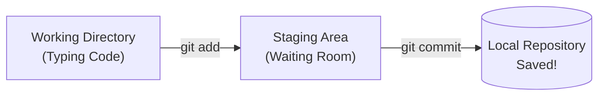

---

## 3. `git branch` & `git switch` (Creating new branches)

**When to use it?**
Writing code directly on the `main` branch (your live website) is incredibly risky. You should always create a new "branch" (a safe copy) to do your experiments or write new features without breaking the main code.

**What to type:**
```bash
# To just create a new branch:
git branch login-feature

# To create a new branch and immediately jump into it (-c means create):
git switch -c login-feature

# (Note: In older Git versions, you'd use "git checkout -b login-feature")
```

---

## 4. `git diff` (Seeing line-by-line changes)

**When to use it?** 
Running `git status` only tells you *which* file was modified (like `index.html`). But if you want to see exactly *which lines* were added or deleted inside that file before you commit, you use `git diff`.

**What to type:**
```bash
# See changes across all files:
git diff

# See changes for just one specific file:
git diff index.html
```
*(In your terminal, deleted lines will show up in red, and new lines in green).*

---

## 5. `git merge` (Combining two branches)

**When to use it?** 
Let's say you branched off `main` to create a new `feature` branch. You've finished your work there, and now you want to bring that new code back into your live `main` branch.

**Before Merge:**
Both branches are moving forward separately.
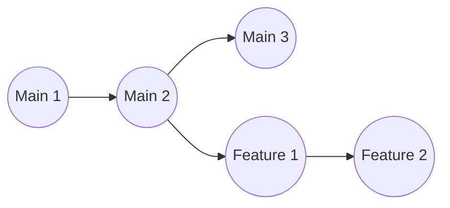

**What to type:**
```bash
# Step 1: Jump into the branch you want to bring the code INTO (like main)
git switch main

# Step 2: Merge the other branch into this one
git merge feature-branch
```

**After Merge:**
Git creates a brand new "Merge Commit" that ties the code from your Feature branch into your Main branch.
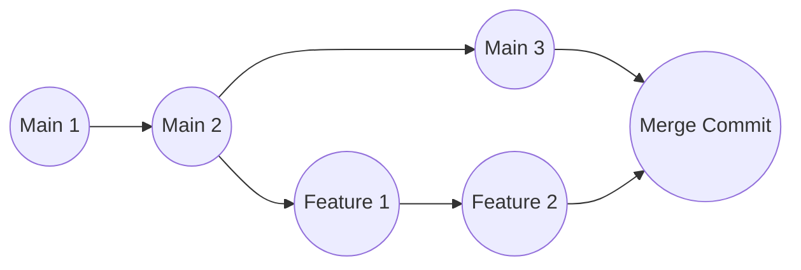

---

## 6. `git rebase` (Keeping history perfectly straight)

**When to use it?** 
You don't want to use `git merge` because it creates extra "Merge Commits" that clutter up the project history. Rebase takes your Feature branch commits and cleanly attaches them to the very tip of the Main branch.

**Before Rebase:**
Your Feature branch branched off at 'Main 1'. But suddenly, 'Main 2' was added by someone else.
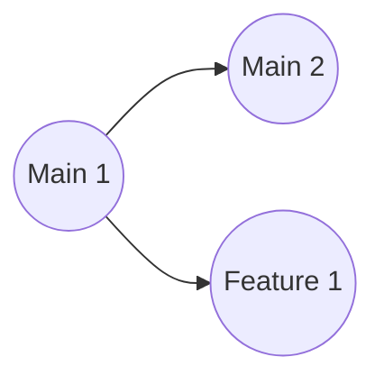

**What to type:**
```bash
# Go to your feature branch
git switch feature-branch

# Rebase it onto main
git rebase main
```

**After Rebase:**
The "base" of your Feature branch is rewritten. It no longer sprouts from Main 1; it gets picked up and placed right after Main 2. A perfectly straight line!
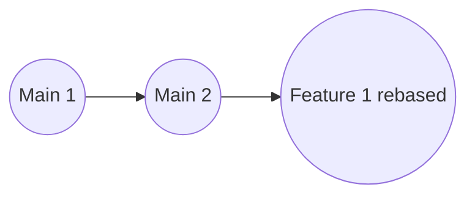

---

## 7. `git stash` (Safely hiding incomplete work)

**When to use it?** 
You're halfway through writing a file, and suddenly your boss asks you to switch branches to fix a critical bug. You can't commit half-finished code, and if you try to switch branches without saving, Git will yell at you. So, you "stash" it away in a hidden drawer.

**Before Stash:**
Your working file has "Half-written code".
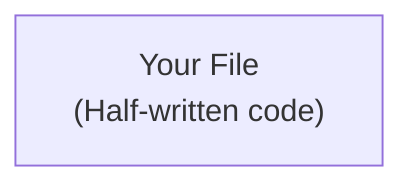

**What to type:**
```bash
# Hide your work in the stash box:
git stash

# ... now you can safely switch branches and do your fix ...

# When you come back, bring your hidden work back into your files:
git stash pop
```

**After Stash:**
Your unfinished work goes into the "Stash Box", leaving your file perfectly clean. When you run `pop`, it jumps right back into your file.
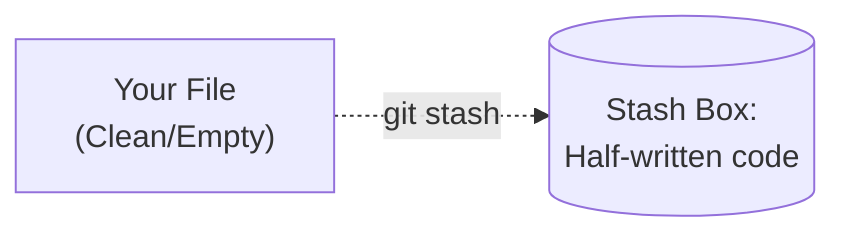

---

## 8. `git push` (Sending work to GitHub)

**When to use it?** 
You've made a bunch of commits on your computer (Local Repo). Now you need to upload them to the internet (GitHub/GitLab) so your team can see your brilliant work.

**Before Push:**
Your laptop has 3 commits, but GitHub is stuck in the past with only 1 commit.
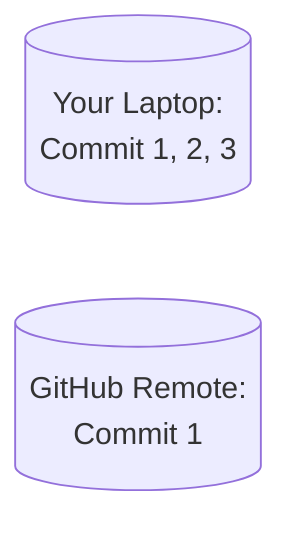

**What to type:**
```bash
# Upload your local 'main' branch up to 'origin' (GitHub)
git push origin main
```

**After Push:**
Your new commits fly through the internet, and GitHub is now perfectly synced with your laptop.
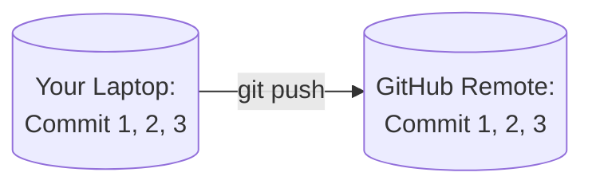

---

## 9. `git fetch` vs `git pull` (Getting remote code)

**`git fetch` (Just looking around):**
**When to use it?** You want to see what your team pushed to GitHub, but you don't want to risk messing up the files you're currently working on.
```bash
git fetch origin
```
**Fetch Diagram:** The new data is downloaded into a hidden "Tracking Branch". Your actual working files remain completely untouched and safe.
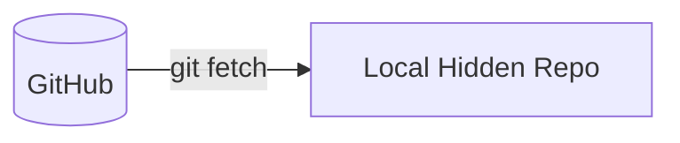

**`git pull` (Look and Apply):**
**When to use it?** You want to download the latest code from GitHub and immediately apply it to your files so you can start working on the latest version.
```bash
git pull origin main
```
**Pull Diagram:** Pull actually runs two commands back-to-back. It fetches the data, and then automatically merges it into your files.
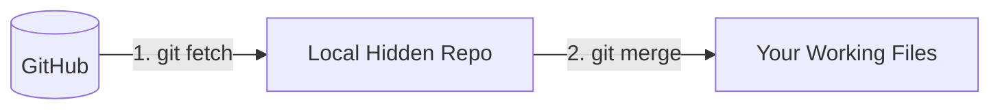

---

## 10. `git reset` (Undoing local mistakes)

**When to use it?**
You wrote some code, committed it, and immediately realized it completely broke your app. **(Important: You haven't pushed this to GitHub yet!)**. You want to time-travel back to a clean state.

**Before Reset:**
Let's say "Commit 3" contains a massive bug.
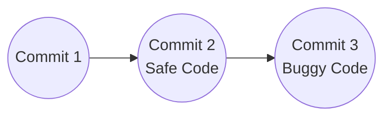

**What to type:**
```bash
# Step 1: Look at your history to find the ID you want to go back to
git log --oneline

# Step 2: Reset to that safe commit (e.g., Commit 2)
# DANGER: --hard will permanently wipe out your messy code and files from Commit 3
git reset --hard <Commit-2-ID>
```

**After Reset:**
"Commit 3" is completely wiped from history. Git takes you literally back in time to Commit 2.
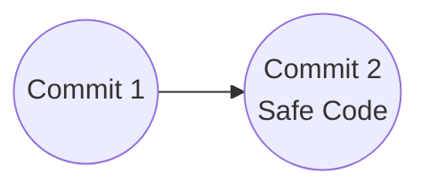

---

## 11. `git revert` (Fixing mistakes already on GitHub)

**When to use it?**
You messed up, and worse, you accidentally `push`ed that bad code up to GitHub (the remote server). If you use `reset` now, you'll mess up your entire team's history. Instead, we use `revert`. It doesn't delete history; it creates a new "Anti-Commit" that undoes the mistake.

**Before Revert:**
Commit 2 is buggy, and everyone on the team already has it.
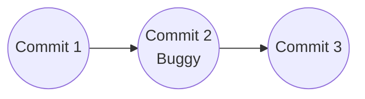

**What to type:**
```bash
# Revert the specific commit that caused the problem
git revert <Commit-2-ID>
```

**After Revert:**
Commit 2 is NOT deleted. Instead, Git creates a brand new "Commit 4". If you added a bad line in Commit 2, Commit 4 will automatically delete that exact line to fix the problem safely.
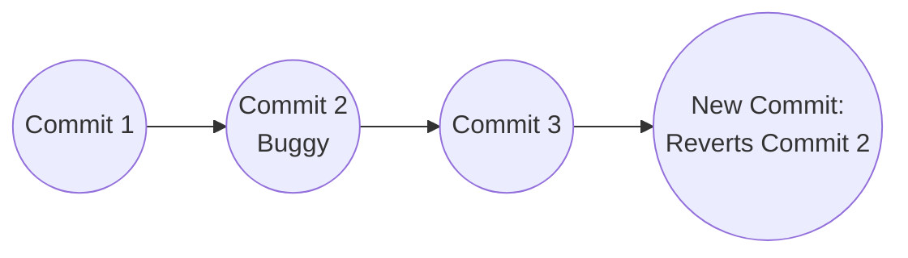

---

## 12. `git cherry-pick` (Stealing a specific commit)

**When to use it?**
Your coworker has 10 commits on their branch. You don't want to merge their entire branch, but you really need the code they wrote in just one specific commit (e.g., "Feature 2").

**Before Cherry-pick:**
You are on Main, and you only want that one specific commit from the Feature branch.
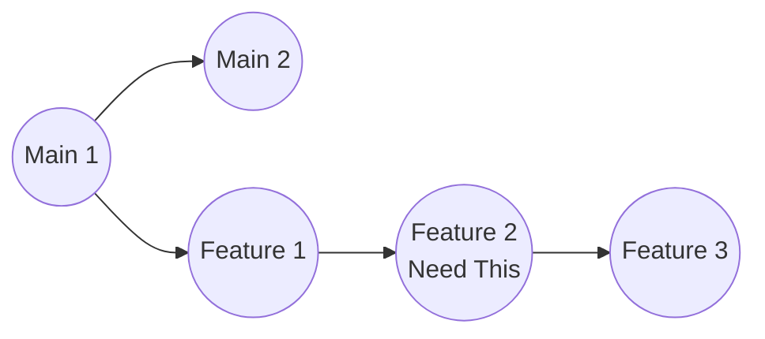

**What to type:**
```bash
# Step 1: Be on the branch that needs the code
git switch main

# Step 2: Grab the specific commit ID from the other branch and cherry-pick it
git cherry-pick <Feature-2-ID>
```

**After Cherry-pick:**
The Feature branch stays exactly the same, but a duplicate clone of "Feature 2" is slapped onto the end of your Main branch.
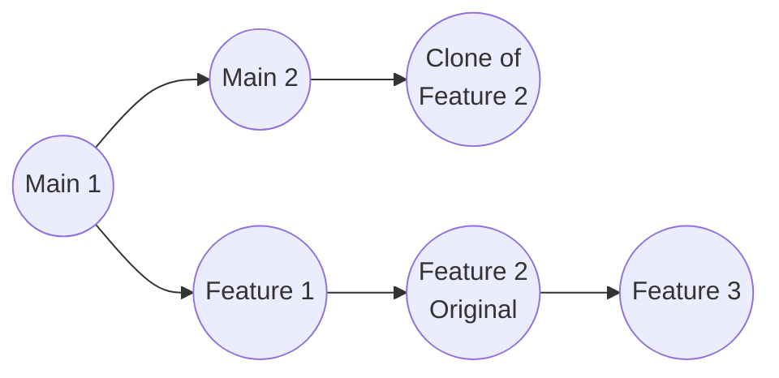

---

## 13. `git blame` (Who wrote this terrible code?)

**When to use it?** 
Your app crashes, and you trace the bug to line 45 of `style.css`. You want to know exactly which developer wrote that specific line and in what commit they did it.

**What to type:**
```bash
git blame style.css
```
*(Your terminal will print out every single line of the file, alongside the name, date, and commit ID of the person who last touched that line).*

---

## 14. `git log` vs `git reflog` (Git's CCTV Camera)

**The Important Difference (A True Lifesaver):**
- **`git log`**: This only shows the "active" timeline. If you accidentally delete a commit using `git reset --hard`, it will vanish completely from `git log`.
- **`git reflog`**: This is Git's hidden CCTV camera. It secretly records every single action you take—when you deleted a commit, when you switched branches, everything. If you accidentally wipe out your data, you can look at the `git reflog`, find the ID of the deleted code, and bring it back from the dead!

**What to type:**
```bash
# To see normal history:
git log --oneline

# To see EVERYTHING (including deleted history):
git reflog
```

---

# The Ultimate Differences Summary

To wrap things up, here is a cheat sheet summarizing the differences between the most confusing commands in Git:

| Comparison | Command 1 (Safe / Local) | Command 2 (Aggressive / Remote) |
| :--- | :--- | :--- |
| **Starting Out** | **`git init`**: Turns a blank folder on your computer into a Git project. | **`git clone`**: Downloads a fully built project from a server to your computer. |
| **Combining Branches** | **`git merge`**: Keeps history exactly as it happened and creates a safe "Merge Commit". | **`git rebase`**: Rewrites history to make everything look like one straight, clean line. **(Never rebase a shared branch).** |
| **Getting Remote Code** | **`git fetch`**: Just downloads data and hides it. Doesn't touch your working files. **(100% Safe).** | **`git pull`**: Downloads data and forces it into your working files. Can cause conflicts! |
| **Fixing Mistakes** | **`git reset`**: Time-travels and erases history. **(Only use if you HAVEN'T pushed yet).** | **`git revert`**: Doesn't erase anything; creates a new anti-commit to undo the mistake. **(Best for pushed code).** |
| **Viewing History** | **`git log`**: Shows your standard, active commit history. | **`git reflog`**: Shows every single action you've ever taken, including deleted commits (The CCTV). |


> **The Golden Rule of Git:** 
> If a branch (like `main`) has already been pushed to the internet and shared with other developers, **NEVER run `git reset` or `git rebase` on it**. Always use `git revert` and `git merge` instead. You can do whatever you want (reset/rebase) on your own local, unshared branches!
