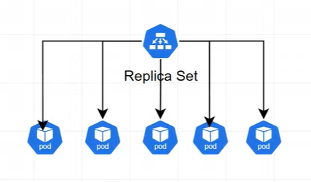

# 🌐 Kubernetes Simple Syllabus

## 1. Kubernetes Basics
- **K8s (Kubernetes)** → A tool to manage and run many containers together.  
- It helps in **automation, scaling, and healing** of applications.

---

## 2. Kubernetes Architecture
- **Control Plane** → Brain of Kubernetes (API Server, etcd, Scheduler, Controller Manager).  
- **Worker Node** → Machines where apps run (Kubelet, Kube Proxy, Container Runtime).  

---

## 3. Pod (Smallest Unit)
- **Pod** → Smallest unit in K8s.  
- A pod is like a **mother of containers** (it can hold one or more containers).  

---

## 4. Controllers (Pod ki maa 👩‍👧)
- **ReplicaSet** → Keeps the right number of pods running.  
downtime aata hai

- **Deployment** → Manages ReplicaSets, allows updates/rollback.  
- **StatefulSet** → For apps that need stable identity & storage.  
- **DaemonSet** → Runs a pod on every node.  
- **Job & CronJob** → For one-time or scheduled tasks.  

---

## 5. Namespaces
- Logical separation in Kubernetes.  
- Helps divide resources (like dev, test, prod environments).  

---

## 6. Networking in Kubernetes
- **Services**  
  - ClusterIP → Internal access only.  
  - NodePort → Exposes service on node’s IP.  
  - LoadBalancer → Connects with cloud load balancer.  
- **NetworkPolicy** → Rules to allow/block traffic between pods.  
- **Ingress Controller** → Manages external access (HTTP/HTTPS).  
- **Gateway API** → Advanced traffic routing (newer than Ingress).  

---

## 7. Extra Concepts
- **ConfigMap & Secret** → Store config and sensitive data.  
- **Volumes & Persistent Volumes** → Storage for pods.  
- **RBAC (Role-Based Access Control)** → Security & permissions.  
- **Helm** → Package manager for Kubernetes apps.  
- **Operators** → Automate complex apps.  

---