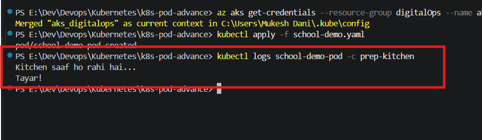
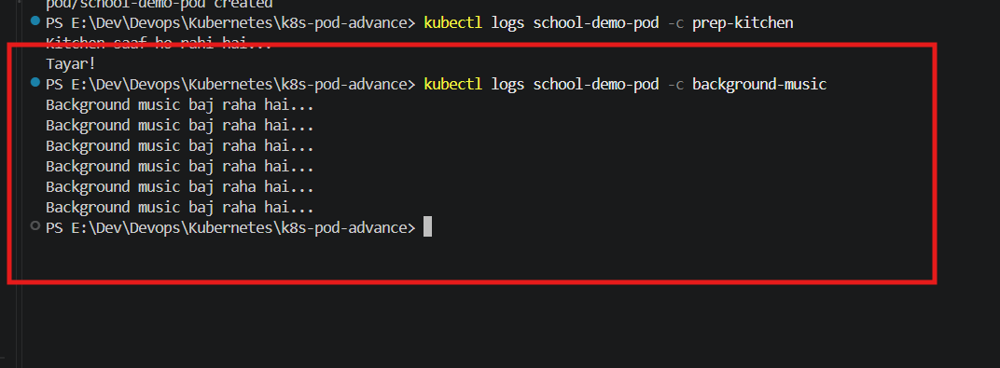
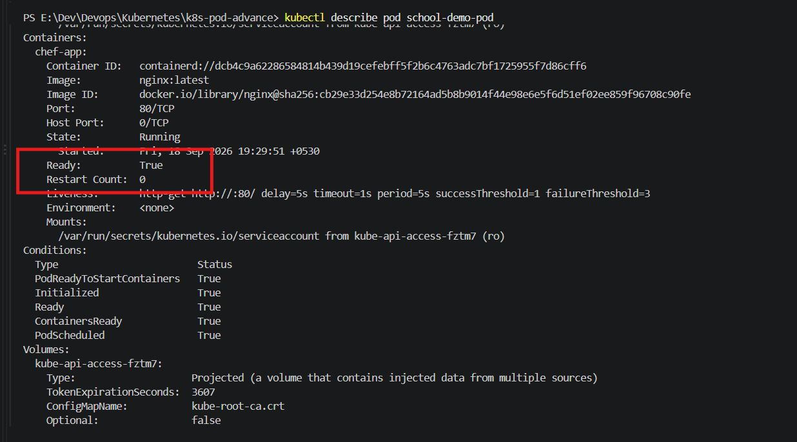
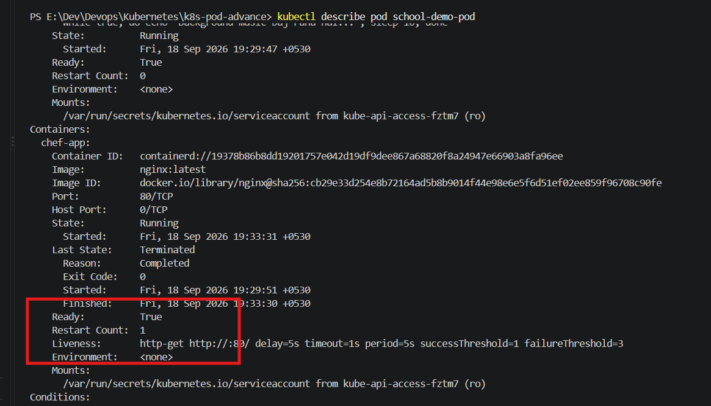

## Deploy to the Cluster

kubectl apply -f school-demo.yaml

## Test 1: Verify if the Init Container Ran First

kubectl logs school-demo-pod -c prep-kitchen

* Output: This will show the message confirming that the kitchen is being cleaned first, after which the init container will terminate successfully.

## Test 2: Verify if the Sidecar Container is Running

kubectl logs school-demo-pod -c background-music

* Output: This will show that the background music message is being printed continuously (because its restartPolicy is set to Always).

## Test 3: Check Probes and Pod Status

kubectl get pod school-demo-pod

* Verification: While the Init container is executing, the status will display as Init:0/1. Once all containers successfully start, the status will transition to Running.

## Test 4: Auto-Healing (Testing the Liveness Probe)

kubectl exec -it school-demo-pod -c chef-app -- rm /usr/share/nginx/html/index.html

* Result: Deleting this file causes the Liveness probe to fail. Kubernetes will then automatically restart the container to restore its health. You can verify that the restart count has increased by running:

kubectl describe pod school-demo-pod
