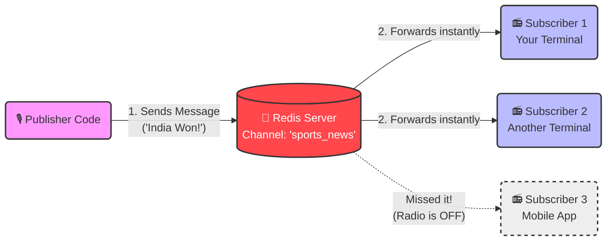

# 🚀 Redis Pub/Sub (Simplified Version)

If you need to explain **Redis Channels (Pub/Sub)** to anyone, you can use this document and diagram to make it super easy for them to understand!

> [!NOTE] 
> **Pub/Sub stands for: Publish (Sender) and Subscribe (Listener).**

---

## 📡 1. Real-Life Example (To explain to others)

Think of it exactly like an **FM Radio Station**:
* **Redis Server:** This is your FM Radio Tower.
* **Channel:** This is the frequency (like `98.3 FM` or `sports_news` in our code).
* **Subscriber (The Listener):** The people who have their radios turned ON and tuned to `98.3 FM`.
* **Publisher (The RJ):** The person speaking on the mic at the station.

**The Rule:** The RJ (Publisher) doesn't know how many people are listening. They just broadcast the voice into the air. Anyone who has their radio ON (Subscribed) will hear it. If someone's radio is OFF, they will miss the news forever!

---

## 📊 2. Architecture Diagram (How it works under the hood)



---

## 💻 3. Code Connection (Which line does what?)

When you are explaining the code to someone, just show them these 3 main steps:

### Step 1: Connecting to the Tower
Whether it is the Publisher or the Subscriber, both must first connect to the Redis server.
```javascript
const client = redis.createClient();
await client.connect(); 
// (This line connects your Node app to the Redis Database)
```

### Step 2: Tuning In (Subscriber)
The subscriber just writes a function and waits. It's exactly like turning the radio ON and waiting for a song.
```javascript
await subscriber.subscribe('sports_news', (message) => {
    console.log(`BREAKING NEWS: ${message}`);
});
// (Here 'sports_news' is the FM frequency. Whenever a message hits this frequency, the console.log automatically runs!)
```

### Step 3: Speaking on the Mic (Publisher)
The publisher doesn't wait. Whenever they have news, they just blast it out.
```javascript
await publisher.publish('sports_news', "Virat Kohli scored a century!");
// (This line tells Redis: "Take this message and immediately distribute it to everyone listening to 'sports_news'!")
```

---

### 💡 Bonus Interview Tip:
If the interviewer asks: *"What happens if the Publisher sends a message, but the Subscriber is Offline/Dead?"* 

**Your Answer:** *"In Redis Pub/Sub, messages are NOT saved on the disk. If the subscriber is offline, that message is lost forever to them. If we want to store the history so they can read it later when they come online, we must use **Redis Streams** or **Apache Kafka** instead of Pub/Sub."*
