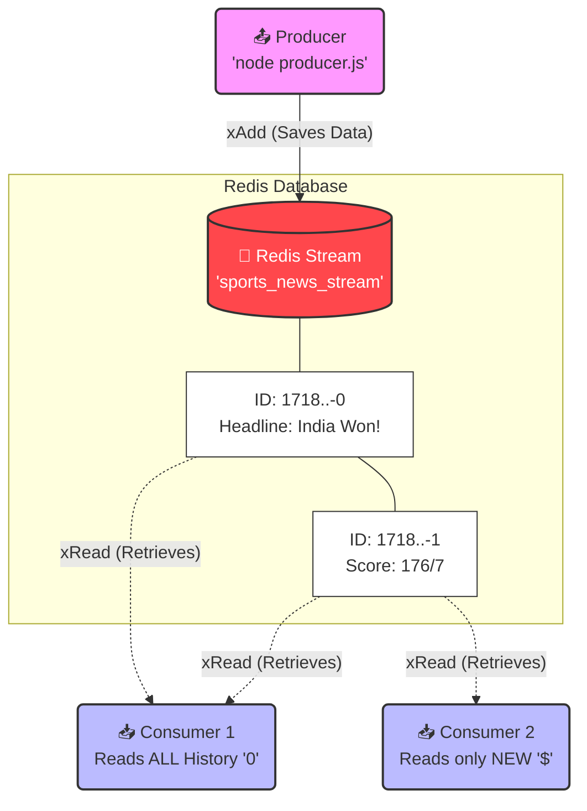

# 📨 Redis Streams

If you need to explain **Redis Streams** to anyone, this document will make it incredibly easy to understand, especially when comparing it to Pub/Sub!

> [!NOTE] 
> **Unlike Pub/Sub, Streams SAVE your data permanently. It is an append-only log, meaning messages are stacked one after the other with a timestamp ID.**

---

## 📬 1. Real-Life Example (To explain to others)

Think of Redis Streams exactly like a **Physical Mailbox or an Email Inbox**:
* **Redis Stream:** This is the physical Mailbox at your house.
* **Producer (The Sender):** The Postman who drops a letter into the mailbox. Every letter gets a unique Timestamp Stamp (ID).
* **Consumer (The Reader):** You, the person opening the mailbox. 

**The Rule:** Unlike the Radio (Pub/Sub), the Postman (Producer) drops the letter and leaves. The letter **stays in the box safely**. Even if you were sleeping (Offline) when the Postman came, you can wake up hours later, open the box, and read all the letters you missed!

---

## 📊 2. Architecture Diagram (How it works under the hood)



---

## 💻 3. Code Connection (Which line does what?)

When you are explaining the Streams code to someone, show them these 3 main steps:

### Step 1: Sending Data to the Log (Producer)
The producer sends data to the stream using `xAdd`. It passes `*`, which tells Redis to automatically generate a unique ID based on the current time.
```javascript
const messageId = await publisher.xAdd('sports_news_stream', '*', {
    headline: "India won the T20 World Cup!"
});
// (This saves the message permanently. It returns an ID like '1786262684471-0')
```

### Step 2: Reading the Log (Consumer)
The consumer uses `xRead`. The `BLOCK: 0` means "If there are no messages, freeze the terminal and wait forever until one arrives."
```javascript
const response = await client.xRead(
    [ { key: 'sports_news_stream', id: lastId } ],
    { BLOCK: 0 } 
);
// (This fetches the message and brings it into your Node app)
```

### Step 3: Tracking the Last ID (The Magic Trick)
To avoid reading the exact same message twice, the Consumer must remember the ID of the last message it read.
```javascript
let lastId = '0'; // '0' means read everything from the beginning. '$' means read only future messages.

// Inside the loop:
lastId = msg.id; // Updates the ID so the next loop starts reading AFTER this message!
```

---

### 💡 Bonus Interview Tip:
If the interviewer asks: *"Why would you use Redis Streams instead of Apache Kafka?"* 

**Your Answer:** *"Redis Streams provides a lot of the same features as Kafka (like Consumer Groups, persistence, and message ordering), but it is much lighter and easier to set up. If we are already using Redis for caching in our system, using Redis Streams prevents us from having to manage and pay for a heavy, complex Kafka cluster just for a simple message queue."*
