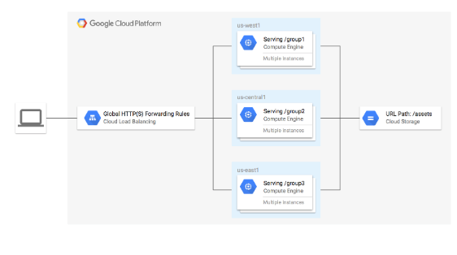
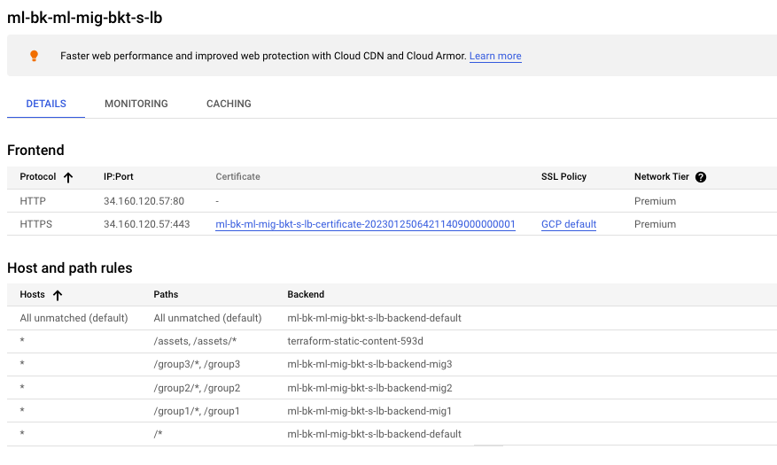
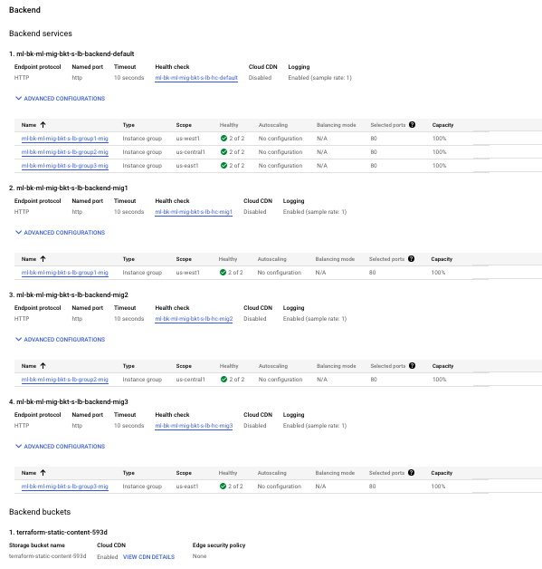

In this lab, you will create an HTTPS load balancer to forward traffic to a custom URL map. The URL map sends traffic to the region closest to you with static assets being served from a Cloud Storage bucket. The TLS key and certificate is generated by Terraform using the TLS provider.

The following is a diagram of the architecture you will be creating:

Objectives
In this lab, you will:

Learn about the load balancing modules for Terraform
Configure Terraform in the Google Cloud environment
Create a global HTTPS Content-Based Load Balancer

## Task 1. Clone the sample repository

1. In Cloud Shell, clone the terraform-google-lb-http repository:
      git clone https://github.com/GoogleCloudPlatform/terraform-google-lb-http.git

2. Navigate to the multi-backend-multi-mig-bucket-https-lb directory:
      cd ~/terraform-google-lb-http/examples/multi-backend-multi-mig-bucket-https-lb

3. On the Cloud Shell toolbar, click the Open Editor icon.

4. Open the file examples/multi-backend-multi-mig-bucket-https-lb/main.tf.

5. On line 133, inside the gce-lb-https module, add the following lines:

        create_ssl_certificate = true
        managed_ssl_certificate_domains = ["example.com"]

6. In the examples/multi-backend-multi-mig-bucket-https-lb/variables.tf file, update the region definitions to the following:
        group1_region = region 1
        group2_region = region 2
        group3_region = region 3

## Task 2. Run Terraform

Initialize a working directory
The terraform init command is used to initialize a working directory containing Terraform configuration files. This command performs several different initialization steps to prepare a working directory for use. This command is always safe to run multiple times, to bring the working directory up to date with changes in the configuration.

* Run the command:
    terraform init

Create an execution plan
The terraform plan command is used to create an execution plan. Terraform performs a refresh, unless explicitly disabled, and then determines what actions are necessary to achieve the desired state specified in the configuration files.

This command is a convenient way to check whether the execution plan for a set of changes matches your expectations without making any changes to real resources or the state. For example, terraform plan might be run before committing a change to version control, to create confidence that it will behave as expected.

1. Run the following command to create an execution plan:
      terraform plan -out=tfplan -var 'project=Project ID'

The optional -out argument can be used to save the generated plan to a file for later execution with terraform apply.

2. List out current directory content. You will see the saved Terraform plan (tfplan):
         ls

Apply the changes
The terraform apply command is used to apply the changes required to reach the desired state of the configuration, or the pre-determined set of actions generated by a terraform plan execution plan.

1. Apply the Terraform plan:
           terraform apply tfplan

Verify the resources created by Terraform:

        In the Navigation menu navigate to Network services > Load Balancing.

        Wait until you see the green checkmark in the Backends column.

        Click on ml-bk-ml-mig-bkt-s-lb load balancer and check the details.

5. Run the following to get the external URL:
    EXTERNAL_IP=$(terraform output | grep load-balancer-ip | cut -d = -f2 | xargs echo -n)
    
     echo https://${EXTERNAL_IP}

6. Click on the EXTERNAL_IP link that is returned to open the load balancer URL in a new browser tab. It will take a few minutes to load.

   Note: If you don't get the expected output in the browser, make sure your load balancer details panel is the same as an above screenshot and wait for few minutes.
   Note: If you get a privacy error, click on Advanced and then proceed.

7. Now append the URL with group1, group2 and group3.
Your final URLs should look like (make sure to replace EXTERNAL_IP with your load balancer IP):https://EXTERNAL_IP/group1

    For group1: You should see the Google Cloud logo and instance details from the group in region 1.
    https://EXTERNAL_IP/group2

    For group2: You should see the Google Cloud logo and instance details from the group in region 2
    https://EXTERNAL_IP/group3

    For group3: You should see the Google Cloud logo and instance details from the group in region 3